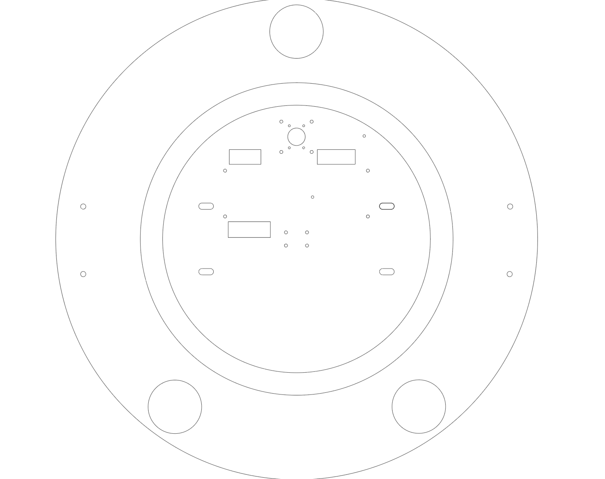

# Frame Assembly

This guide covers setting up the dolly base and attaching the laser-cut circular mounting plate.

---

## Parts Required

| Qty | Part |
|-----|------|
| 1 | Trash Can Dolly with Wheels |
| 1 | Circular Mounting Plate (laser cut) |
| ~10 | Screws |
| ~8 | Nuts |
| 2 | Screwdrivers |

---

## Laser Cut Files

Download the templates before starting:

- [`trashbot_guidlines_all.ai`](https://github.com/IRL-CT/Summer25_Trashbot/blob/main/images/trashbot_guidlines_all.ai) — full drilling template
- [`trashbot_guidlines_inner.ai`](https://github.com/IRL-CT/Summer25_Trashbot/blob/main/images/trashbot_guidlines_inner.ai) — inner circular mounting plate

<figure markdown>
  { width="500" }
  <figcaption>Laser cut template</figcaption>
</figure>

---

## Part A: Setting Up the Dolly

### Step 1: Remove the circular top of the dolly

<figure markdown>
  { width="500" }
  <figcaption>Original dolly chassis</figcaption>
</figure>

### Step 2: Laser-cut the drilling template and the circular plate

Cut both the drilling template and the mounting plate using the `.ai` files above.

<figure markdown>
  { width="500" }
</figure>

### Step 3: Align and drill outer holes

Place the drilling template over the dolly and align it. Mark the 4 pre-existing screw hole locations.

<figure markdown>
  { width="500" }
  <figcaption>Drilling the outer mounting holes</figcaption>
</figure>

### Step 4: Secure the dolly

Drill 4 matching holes and secure the dolly using 4 screws and 4 nuts.

<figure markdown>
  { width="500" }
</figure>

<figure markdown>
  { width="500" }
</figure>

---

## Part B: Attaching the Circular Mounting Plate

### Step 5: Align the circular plate

Align the laser-cut circular plate with the 4 inner mounting holes on the dolly.

### Step 6: Attach with screws and nuts

Secure using 4 screws and 4 nuts through the inner mounting holes.

<figure markdown>
  { width="400" }
  <figcaption>Inner circular mounting plate</figcaption>
</figure>
