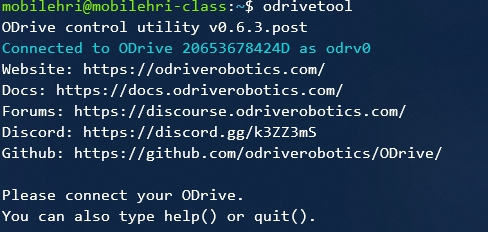
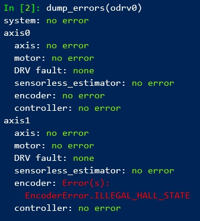

# ODrive Calibration

Calibrate each motor individually on the bench **before** assembling the robot. This sets the motor parameters and verifies the hall sensor connections. Do this once per robot (or after a config reset).

!!! warning
    The motor will beep and spin during calibration. Clamp the wheel securely — never hold it by hand.

!!! tip "After Calibration"
    Once both wheels are calibrated, proceed to [Assembly](../assembly/index.md) to mount everything onto the robot frame.

---

## Part A: Bench Hardware Setup

Before running any software, set up the ODrive and one wheel on the bench.

### A1. Clamp the Wheel

Remove one wheel from the hoverboard with a hex key. Clamp the axle firmly to a desk — the wheel must be **free to spin** but the axle must not move.

<figure markdown>
  { width="400" }
</figure>

<figure markdown>
  { width="400" }
</figure>

---

### A2. Build the Filtering PCBs

Solder three 22 nF capacitors onto each breadboard (one per motor). These filter noise on the hall sensor lines. See the [ODrive hall state post](https://discourse.odriverobotics.com/t/encoder-error-error-illegal-hall-state/1047/7) for details.

<figure markdown>
  { width="500" }
  <figcaption>Filtering PCB — step 1</figcaption>
</figure>

<figure markdown>
  { width="500" }
  <figcaption>Filtering PCB — step 2</figcaption>
</figure>

<figure markdown>
  { width="200" }
  <figcaption>Complete breadboard wiring reference</figcaption>
</figure>

<figure markdown>
  { width="400" }
  <figcaption>Filtering PCB pinout — five pins from GND to 5V</figcaption>
</figure>
---

### A3. Insert Hoverboard Wires to ODrive

Insert hoverboard wires (yellow, blue, green) from the motor to the ODrive board. You may need to solder wire extensions if the wires are too short. Cover any dangling white wires with electrical tape.

The five PCB pins go from GND to 5V — the **red wire connects to the 5V pin** labeled on the ODrive.

<figure markdown>
  { width="500" }
  <figcaption>Yellow / Blue / Green hall sensor connections</figcaption>
</figure>

---

### A4. Insert Brake Resistor into ODrive

Insert the brake resistor into the designated slot in the middle of the ODrive board.

<figure markdown>
  { width="500" }
  <figcaption>Brake resistor placement on ODrive</figcaption>
</figure>

---

### A5. Connect XT60 Power Cable

Connect the XT60 power cable from the hoverboard battery to the ODrive power input.

!!! danger "Polarity"
    Red wire = positive, black wire = negative. Reversing polarity will damage the ODrive.

<figure markdown>
  { width="400" }
</figure>

<figure markdown>
  { width="400" }
</figure>

---

### A6. Connect ODrive to Raspberry Pi

Connect a **micro-USB cable** from the ODrive to the base Raspberry Pi.

---

### A9. Plug In Power

Connect the hoverboard battery. The ODrive power LED should light up.

<figure markdown>
  { width="600" }
  <figcaption>Complete bench setup — ODrive connected to one wheel and Raspberry Pi</figcaption>
</figure>

---

## Part B: Software Calibration

### B1. Flash the Raspberry Pi Image

Use the [Raspberry Pi Imager](https://www.raspberrypi.com/software/) to write the class image to an SD card, then boot the base RPi.

[Download class RPi image](https://drive.google.com/file/d/1PMWyJUoA-CJ73vktrp3nPKiykwzOaauU/view?usp=sharing){ .md-button target="_blank" }

---

### B2. SSH into the Raspberry Pi

```bash
ssh ubuntu@<base-rpi-ip>
```

The IP address is displayed on the miniTFT screen after boot.

---

### B3. Download the Lab Config File

```bash
curl -LJO https://raw.githubusercontent.com/FAR-Lab/Mobile_HRI_Lab_Hub/main/Lab3/mobilehri_config.json
odrivetool restore-config mobilehri_config.json
```

!!! note
    Ignore warnings about parameters not being loaded — you will recalibrate the motors anyway. ODrive parameters may vary between hoverboard models; consult the [ODrive hoverboard guide](https://docs.odriverobotics.com/v/0.5.5/hoverboard.html) if needed.

---

### B4. Open ODrive Tool

```bash
odrivetool
```

The terminal should show `Connected to ODrive xxxxxxxx` and a `>>>` prompt.

<figure markdown>
  { width="600" }
  <figcaption>ODrive tool connected</figcaption>
</figure>

---

### B5. Calibrate Axis 0 (First Wheel)

```python
odrv0.clear_errors()
odrv0.axis0.requested_state = AXIS_STATE_FULL_CALIBRATION_SEQUENCE
```

Wait for the motor to beep and spin briefly (~10–15 seconds), then check for errors:

```python
dump_errors(odrv0)
```

<figure markdown>
  { width="600" }
  <figcaption>Expected output — no errors after successful calibration</figcaption>
</figure>

Check for errors under `axis0`. If you see an `ILLEGAL_HALL_STATE` error, check that the filtering PCB is plugged in correctly. See the [ODrive Hall State troubleshooting thread](https://discourse.odriverobotics.com/t/encoder-error-error-illegal-hall-state/1047/12?page=2) for more help.

If no errors, save and reboot:

```python
odrv0.save_configuration()
odrv0.reboot()
```

---

### B6. Test Axis 0

```python
odrv0.axis0.requested_state = AXIS_STATE_CLOSED_LOOP_CONTROL
odrv0.axis0.controller.input_vel = 2   # 2 turns/second
```

Note the spinning direction. To stop:

```python
odrv0.axis0.controller.input_vel = 0
odrv0.axis0.requested_state = AXIS_STATE_IDLE
```

---

### B7. Calibrate Axis 1 (Second Wheel)

!!! warning
    **Unplug the battery before swapping wheels.** Remove the first wheel's JST connector and phase wires, then connect the second wheel to axis 1.

Reconnect the second wheel's hall sensor JST to the **axis 1** filtering PCB port and screw the phase wires into **M1**.

<figure markdown>
  { width="600" }
  <figcaption>Second wheel connected to axis 1</figcaption>
</figure>

Plug in power and reconnect with `odrivetool`, then:

```python
odrv0.clear_errors()
odrv0.axis1.requested_state = AXIS_STATE_FULL_CALIBRATION_SEQUENCE
dump_errors(odrv0)
```

Check errors under `axis1`. If no errors:

```python
odrv0.save_configuration()
odrv0.reboot()
```

Test axis 1:

```python
odrv0.axis1.requested_state = AXIS_STATE_CLOSED_LOOP_CONTROL
odrv0.axis1.controller.input_vel = 2
odrv0.axis1.controller.input_vel = 0
odrv0.axis1.requested_state = AXIS_STATE_IDLE
```

Both wheels calibrated — proceed to [Assembly](../assembly/index.md).
